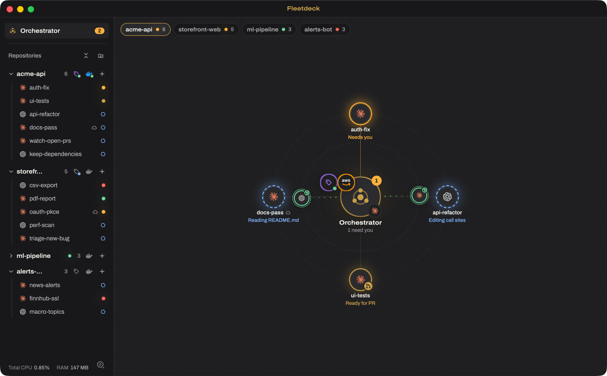
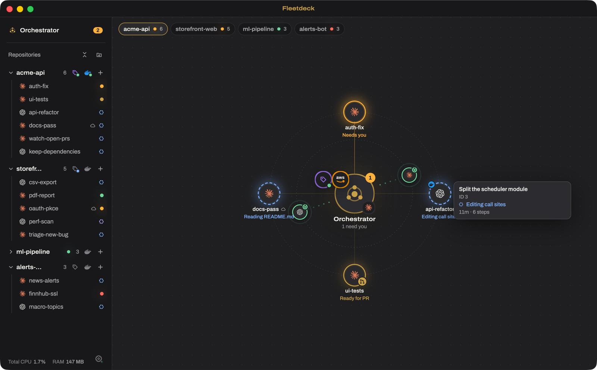
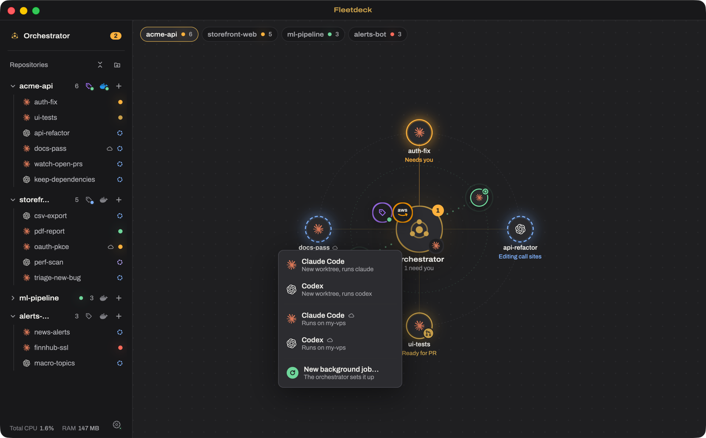
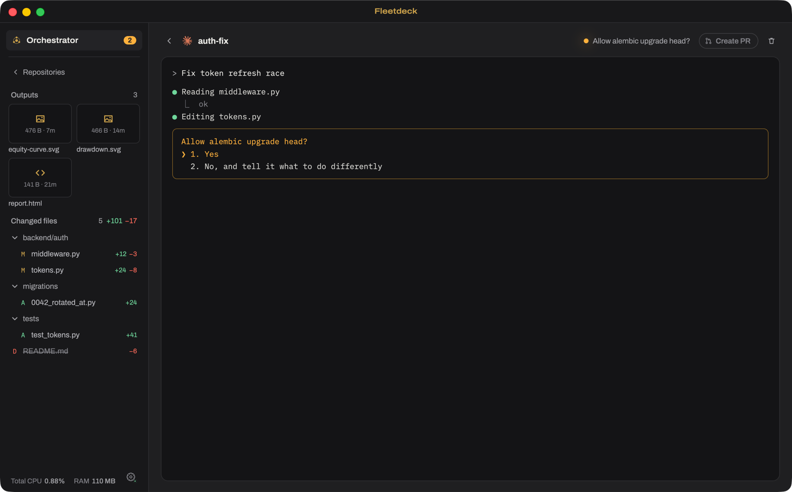
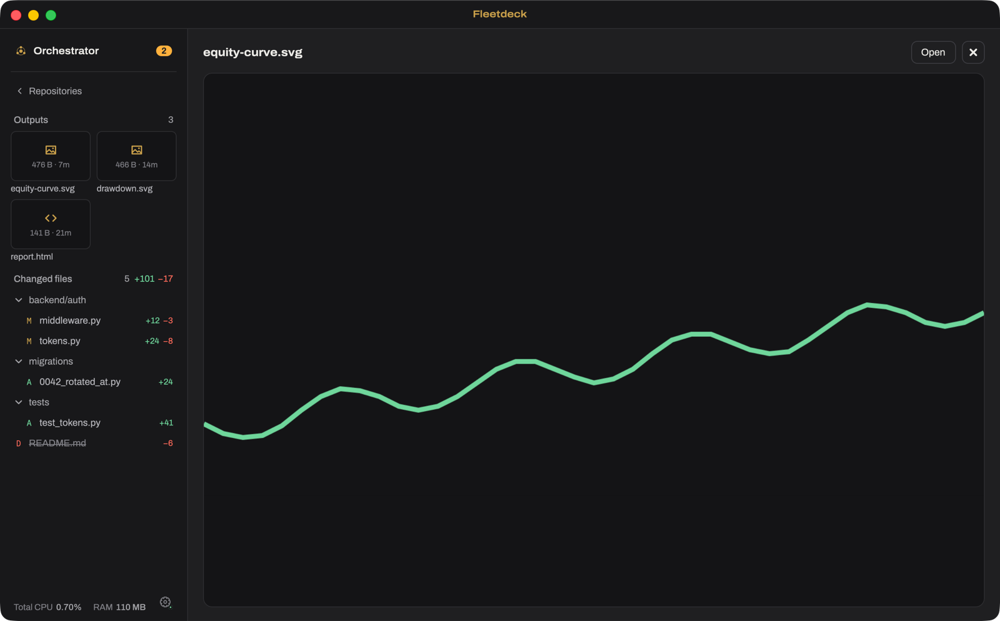
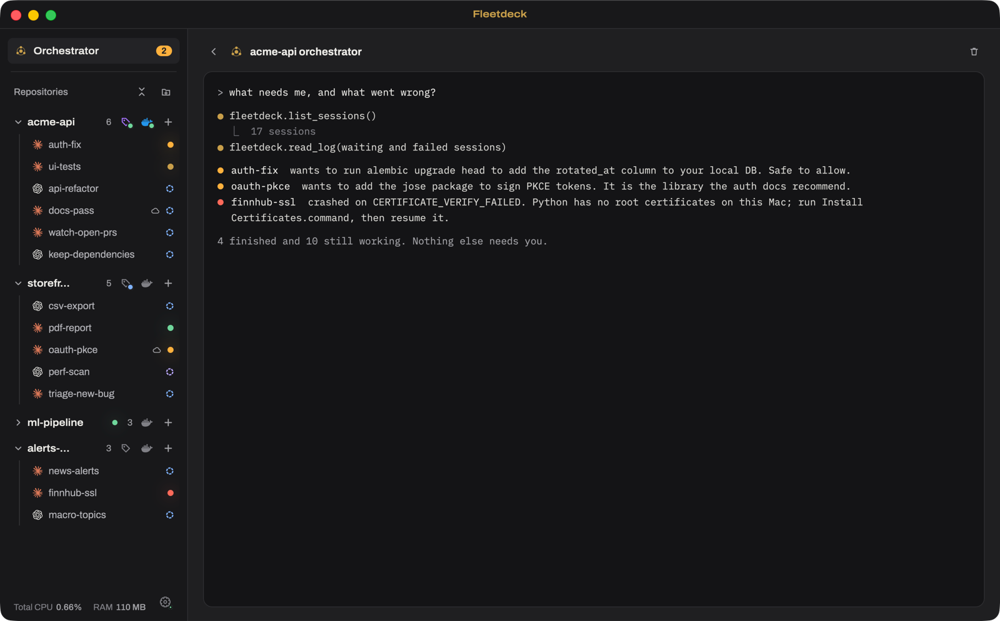
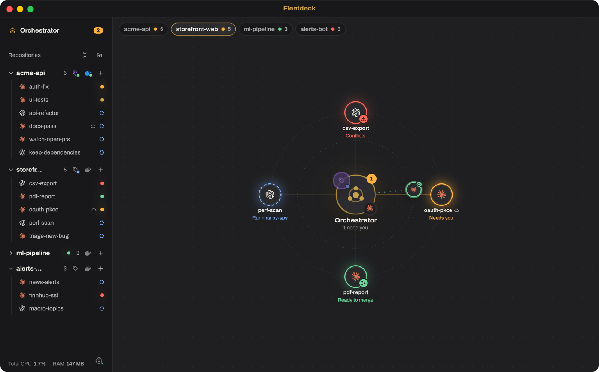
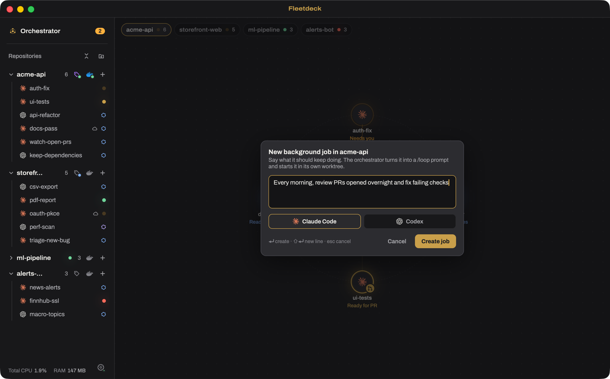
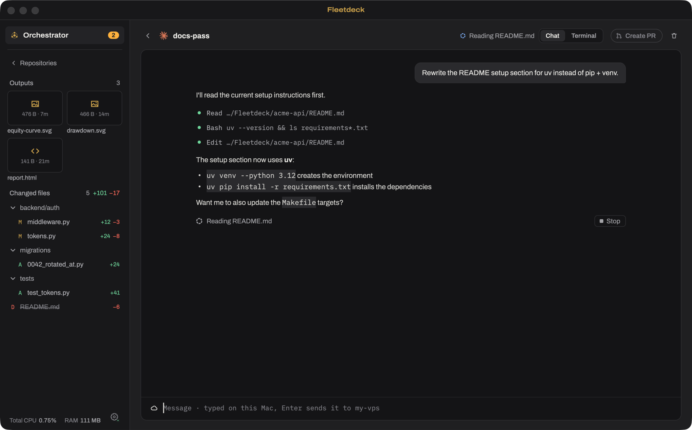
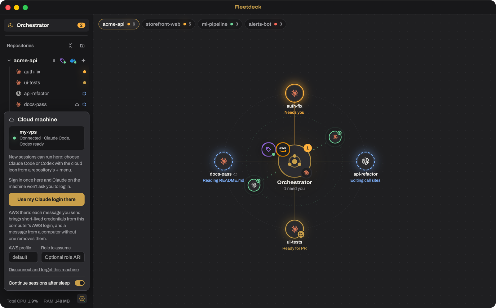

# Fleetdeck

**Mission control for your AI coding agents.** Run a whole fleet of **Claude Code** and **Codex**
sessions side by side, see at a glance which one needs you, and take each one from first prompt to
merged pull request, all from one calm native window on macOS and Windows.

  <a href="https://github.com/mgoulucentaurus/switchboard-releases/releases/download/v0.1.43/Fleetdeck_0.1.43_universal.dmg"><b>Download for macOS</b></a>
  &nbsp;·&nbsp;
  <a href="https://github.com/mgoulucentaurus/switchboard-releases/releases/download/v0.1.43/Fleetdeck_0.1.43_x64-setup.exe"><b>Download for Windows</b></a>

Running three agents at once is normal now. Keeping track of them isn't: a dozen terminal tabs,
none of which tells you which agent finished, which one is stuck on a permission prompt, and which
one just broke the build. Fleetdeck puts every session on one board, gives each its own git
worktree so they never step on each other, and keeps an orchestrator in the middle that knows what
all of them are doing.

## What you can do

### See your whole fleet in one second

Every session is an icon around the orchestrator, and its ring tells you its state: **violet**
while thinking, **blue** while running a tool, **amber** when it needs you, **green** when it's
done, **red** when it failed. Each repository gets its own tab, with a count and a dot for the
state that matters most. When a session needs you while you're elsewhere, you get a notification
and a Dock badge.

Hover any icon for a quick summary: the task, what it's doing right now, how long it has been
going and how many steps, files and commits it has made so far.

### Start an agent in two clicks, in its own worktree

The **+** on a repository, or a click anywhere on the empty board, starts Claude Code or Codex,
on this Mac or on your own cloud machine. Every session gets a fresh git worktree branched from the
latest `origin/main`, so ten agents can work on the same repo at once without touching each
other's files.

### Open the real terminal, answer in one keystroke

Click any icon to open that session's **real** `claude` or `codex` terminal: your slash commands,
MCP servers, keybindings and config all work unchanged. Permission prompts show right there, and
the header shows the next step for its branch. Beside it, the sidebar shows what the session is
producing: the files it changed against main, with +/− counts, and the charts, reports and mockups
it saved.

### Ask the orchestrator what's going on

The orchestrator is a Claude session that can read every other session's log, diff and state. Ask
it "what needs me, and what went wrong?" and get one answer for the whole fleet instead of
scrolling through ten terminals. Each repository has its own orchestrator too, and it can
interrupt or close sessions and jobs for you when you ask.

### Ship the pull request from the board

When a session commits, its icon gets a badge with the next pull-request step: **Create PR**,
**Merge**, **Resolve conflicts** (the session's AI rebases onto the latest main for you) or
**Merged**. One click runs it. Need a second pair of hands on the same change? **Branch** a session:
the new one shares its parent's worktree, branch and pull request, and the two coordinate through a
shared board in the worktree.

### Background jobs that keep working

Describe something that should keep happening ("every morning, review the PRs opened overnight and
fix failing checks") and the orchestrator turns it into a job spec committed to the repo, then
starts it as a looping Claude Code (`/loop`) or Codex (`/goal`) session. Jobs circle the
orchestrator on their own inner orbit, so you can see them working without them crowding the board.

Repositories can also carry their own one-click actions, like **Release** or an **AWS** deploy,
right on the orchestrator.

### Run agents on your own cloud machine

Point Fleetdeck at your own VPS and start sessions there with the cloud icon: they keep running
when your laptop sleeps or closes. Fleetdeck installs its SSH key with your password once (it never
stores it), signs Claude in there for you, and can hand each message short-lived AWS credentials
from this computer. Cloud sessions get a chat view with streaming replies and approval cards, plus
the plain terminal when you want it.

  
  

### Light, native and local

- **Native Rust app** drawn with [GPUI](https://gpui.rs) (Metal on macOS, DirectX on Windows). No
  Electron, no web view.
- **Starts with zero sessions**, so it uses no CLI memory until you start one. Total CPU and RAM sit
  at the bottom of the sidebar, so you always know what your fleet costs your machine.
- **Local-first.** No Fleetdeck server and no telemetry. Your code and transcripts stay on your
  machine (or on your own cloud machine).
- **Never hijacks the CLI.** State comes from the CLIs' own hooks, not from guessing at the screen.
- **Updates itself** in the background and shows "Restart to update" when a new version is ready.

## Install

Download the latest release from
[GitHub Releases](https://github.com/mgoulucentaurus/switchboard-releases/releases/latest):

- **macOS** (Apple Silicon and Intel): `Fleetdeck_<version>_universal.dmg`
- **Windows 10/11**: `Fleetdeck_<version>_x64-setup.exe`

The builds aren't code-signed yet, so the first launch needs one extra step:

- **macOS:** drag Fleetdeck to Applications, then **right-click → Open → Open**. Or run:
  `xattr -dr com.apple.quarantine /Applications/Fleetdeck.app`
- **Windows:** if SmartScreen appears, click **More info → Run anyway**.

### Requirements

Install the CLIs you want to use. Fleetdeck finds them through your normal shell:

| CLI | Install | Then |
|-----|---------|------|
| Claude Code | `npm i -g @anthropic-ai/claude-code` (or the native installer) | run `claude` once to sign in |
| Codex | `npm i -g @openai/codex` | run `codex` once to sign in |
| GitHub CLI (optional, to add GitHub repos) | https://cli.github.com | `gh auth login` |

`git` must be installed, since every session runs in its own worktree under
`~/Fleetdeck/.worktrees/<repo>/`. On Windows, Claude Code also needs Git for Windows.

## Keyboard

| Action | macOS | Windows |
|--------|-------|---------|
| New Claude session in the current repo | ⌘N | Ctrl+N (Ctrl+Shift+N inside a terminal) |
| Open session 1–9 | ⌘1…⌘9 | Ctrl+1…9 |
| Open the orchestrator | ⌘J | Ctrl+J (Ctrl+Shift+J inside a terminal) |
| Back to the board | Esc (outside the terminal) or ⌘[ | Esc or Ctrl+Shift+[ |
| Move between icons | arrow keys, Enter to open | same |

When a CLI asks for permission, or asks whether to trust a new folder, its icon blinks amber. Open
it and press **Allow**, or answer in the terminal. Drop files onto a terminal, or paste an image
into it, to hand them to the agent. **Remove** stops a session and deletes its worktree, asking
first if work would be lost.

---

Latest version: **0.1.43** · [All releases](https://github.com/mgoulucentaurus/switchboard-releases/releases)
